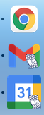

Tired of losing your Rice email and calendar in a see of Chrome tabs?  Follow the instructions below to make separate Chrome apps for both Rice Gmail and Rice Google Calendar.  These apps are separate from Chrome and much easier to access.



# Gmail

In Chrome, go to your Rice GMail.

Right click somewhere on the page, then click "Inspect".  Go to the "Console" tab of the window that pops up.

Copy and paste this at the console prompt, replacing 'example@rice.edu' with your email address:

```js
const email = 'example@rice.edu'
````

Then copy and paste the following and hit enter:

```js
const startUrl = `https://mail.google.com/mail/u/?authuser=${email}`;
const name = 'Rice&nbsp;Gmail';
const description = 'Rice&nbsp;Gmail';
const logo = 'gmail_rice';
```

```js
document.head
  .querySelector(':first-child')
  .insertAdjacentHTML(
    'beforebegin',
    `<link rel="manifest" href='data:application/manifest+json,{"start_url":"${startUrl}", "name":"${name}", "description": "${description}", "icons": [{ "src": "https://github.com/jpslav/my_mac/raw/master/logos/${logo}_512.png", "type": "image/png", "sizes": "512x512" }, { "src": "https://github.com/jpslav/my_mac/raw/master/logos/${logo}_256.png", "type": "image/png", "sizes": "256x256" }, { "src": "https://github.com/jpslav/my_mac/raw/master/logos/${logo}_128.png", "type": "image/png", "sizes": "128x128" }]}' />`,
  );
```

Next, go to the three-dot menu in the upper right corner of Chrome.  Click More Tools | Create Shortcut...

You should see "Rice Gmail" in the dialog box.  Check the "Open in new window" box and hit "Create".

Your new app will be in your dock (in Mac OS).  Right-click on it, click on "Options", then select "Keep in Dock".

# Google Calendar

Ditto the above except start from your Rice Google Calendar and replace the middle block of Javascript with:

```js
const startUrl = `https://calendar.google.com/calendar/?authuser=${email}`;
const name = 'Rice&nbsp;Calendar';
const description = 'Rice&nbsp;Calendar';
const logo = 'gcal_rice';
```

# Google Drive

Ditto above except middle block of Javascript is:

```js
const startUrl = `https://drive.google.com/drive/u/?authuser=${email}`;
const name = 'Rice&nbsp;Drive';
const description = 'Rice&nbsp;Drive';
const logo = 'drive_rice';
```
